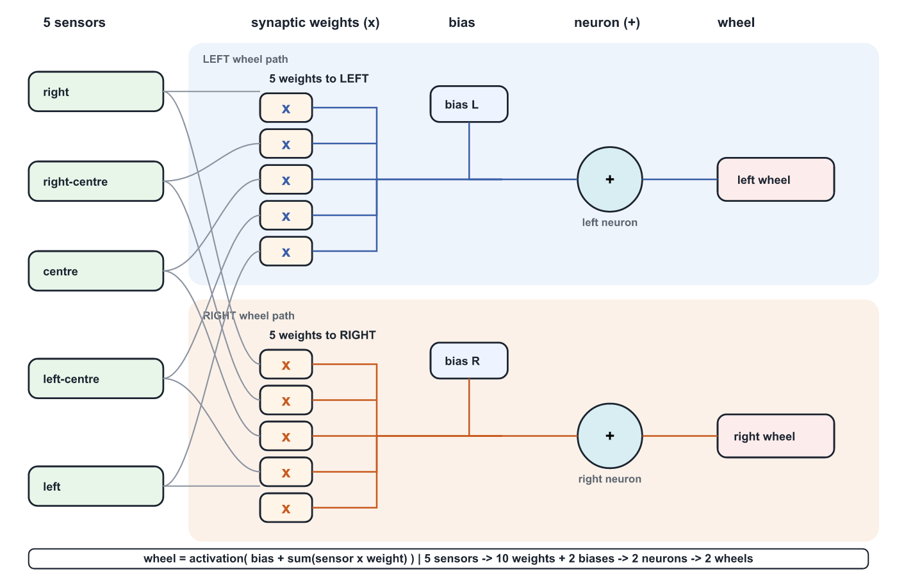
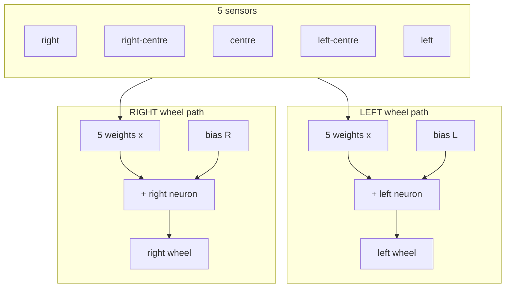

# Class plan: introduce neural networks with Thymio

A ready-to-run lesson for teachers using the **Thymio 3 ANN Edu** interface.
No prior neural-network knowledge is required of the pupils.

| | |
|---|---|
| **Audience** | Ages ~10–15 (adaptable), class or workshop |
| **Duration** | 45–60 minutes |
| **Demo** | https://francescomondada.github.io/Thymio3-ANN-Edu/ |
| **Modes** | Simulated sensors (any browser) · optional real Thymio 3 (Chrome/Edge) |

---

## Learning goals

By the end of the lesson, pupils can:

1. Name the four steps of this tiny “brain”: **Sense → Multiply → Add → Send**.
2. Explain that a **weight** scales a sensor (push forward / pull backward).
3. Explain that the **neuron adds** several scaled signals, then the **total goes to the motor**.
4. Predict how changing a weight or picking a **preset** (Avoid, Follow, …) changes behaviour.

Optional stretch: invent a behaviour by tweaking weights (Custom).

---

## Network structure (for the board)

Show this figure once before diving into Sense → Multiply → Add → Send.
It is the whole “brain” used by the interface:

[Open as SVG](ann-structure.svg) if you prefer a vector copy for slides.

| Block | Count | Role in class language |
|-------|------:|------------------------|
| **Sensors** | 5 | Front proximity inputs (right … left) |
| **Left weights** | 5 | Vertical stack on top — each sensor `x` into the left neuron |
| **Right weights** | 5 | Vertical stack below — each sensor `x` into the right neuron |
| **Biases** | 2 | On the side of each path (`bias L` top, `bias R` bottom) |
| **Neurons** | 2 | Each **adds** bias + five weighted sensors (`+`) |
| **Wheels** | 2 | Neuron total is **sent** as left / right motor speed |

So pupils can count: **5 → (5+5) weights + 2 biases → 2 neurons → 2 wheels**.

---

## Materials

- Projector or shared screen (teacher machine).
- Pupil devices optional (tablets/laptops) for pair work on the same demo URL.
- **Without robot:** use **Sensors → Simulated**.
- **With robot:** one Thymio 3, Bluetooth on, Chrome or Edge, HTTPS demo page; clear floor space (~1–2 m).

Open the [live demo](https://francescomondada.github.io/Thymio3-ANN-Edu/) before class and set language (EN / FR / DE / IT) in the top bar.

Suggested starting state:

- Mode: **See**
- Look at: **Both** (or Left, if you want a simpler first pass)
- Sensors: **Simulated** (switch to Robot later if available)
- Preset: **Avoid**

---

## Lesson flow

### 0. Hook (3 min)

Ask: *“How does a robot decide to turn away from a wall without someone writing ‘if wall then turn’ for every case?”*

Show the Thymio diagram (or the [network structure figure](ann-structure.png)).
Point to sensors on the left and motors on the right.  
Promise: *“Today we’ll open a very small brain and watch the numbers move.”*

---

### 1. Sense (8 min) — “What does the robot feel?”

**Do**

1. Stay in **See**. Keep **Avoid**.
2. With **Simulated** sensors, watch a reading light up (or hold an object in front of a connected robot).
3. Tap a bright sensor to **lock** focus; use **Follow brightest** when you want auto-focus again.
4. Read the story strip: step **1 Sense**.

**Say**

- Sensors are the robot’s “eyes” for near objects.
- Numbers go up when something is close.
- We look at **one path at a time** so the story stays readable.

**Check**

- *“Which sensor is loudest right now?”*
- *“If I move the object to the right, which bar should grow?”*

---

### 2. Multiply (10 min) — “Weights decide push or pull”

**Do**

1. Switch to **Tweak**.
2. Keep focus on one sensor (e.g. centre or the brightest).
3. Move the **backward / forward** slider for that sensor → wheel.
4. Watch the **×** in the diagram and story step **2 Multiply**.

**Say**

- A **weight** multiplies the sensor.
- Positive → tends to drive that wheel **forward**; negative → **backward**.
- Same sensor can push the left wheel one way and the right wheel another way (that’s how turning appears).

**Check**

- *“If the weight is zero, does this sensor change the motor?”* (No contribution.)
- *“What happens if I flip the sign of the weight?”*

Classroom tip: use classroom display scaling — kids can multiply the simplified numbers by hand; the UI shows sensor÷100 and weight÷10 so the product matches the real network.

---

### 3. Add, then Send (10 min) — “The neuron is a summing point”

**Do**

1. Point at the graphical **+** (Add) and the term list (bias + each sensor contribution).
2. Story steps **3 Add** (“into the neuron”) and **4 Send** (“to motor speed”).
3. Change **bias** under Add: a constant push even when sensors are quiet.
4. Point at **Motors**: neuron total → motor command.

**Say**

- The neuron does **not** “decide” with an if-then for each sensor.
- It **adds** bias + every (sensor × weight).
- That total is **sent** as wheel speed (sometimes limited / clamped if too large).

**Check**

- *“Where does adding happen — in the wheel or in the neuron?”* (Neuron.)
- *“What leaves the neuron?”* (A number for motor speed.)

---

### 4. Behaviours from weights (12 min) — presets as experiments

**Do** (still projected, or in pairs)

Try presets without changing Look-at mid-demo (presets only change the brain, not the camera):

| Preset | Ask the class to predict | Then try |
|--------|--------------------------|----------|
| **At rest** | Motors stay ~0 | Confirm |
| **Straight ahead** | Bias alone drives forward | Sensors quiet → still rolls |
| **Avoid** | Obstacle on one side → turn away | Classic first demo |
| **Follow** | Steer toward what it sees | Contrast with Avoid |
| **Back away** | Both wheels reverse when something is near | “Shy” robot |

After any manual edit, the chip becomes **Custom** — good moment to say: *“You changed the brain; it’s no longer a named recipe.”*

**Check**

- *“Is Avoid a different program, or the same machine with different numbers?”* (Same machine, different weights/bias.)

---

### 5. Challenge (8–12 min)

Pick one challenge appropriate to time and hardware:

**A. Simulation only**  
“Make the robot back away only when the **centre** sensor lights up. Side sensors should do little.”  
→ Tweak centre weights negative; sides near zero; Custom.

**B. With a real robot**  
Connect → Sensors **Robot** → wait until **sensors live** → **Run on robot**.  
Obstacle course: can Avoid keep it from hitting a book? Can Follow chase a hand?

**C. Debate**  
“Is this learning?”  
Answer to aim for: *Not yet — we set the weights. Learning would be changing weights from experience. Today we only run a fixed network.*

---

### 6. Wrap-up (3 min)

Return to the four words on the board:

1. **Sense** — sensors  
2. **Multiply** — weights  
3. **Add** — neuron  
4. **Send** — motors  

Exit ticket (one sentence): *“A neural network for this robot is …”*  
Accept answers like: *“numbers that mix sensor readings into motor speeds.”*

---

## Differentiation

- **Younger / shorter:** stop after Sense → Multiply → one preset (Avoid). Skip bias.
- **Older / STEM:** show the formula  
  `wheel ≈ activation( bias + Σ weight × sensor/1000 )`  
  and link to the expert app: [Thymio3-ANN](https://github.com/FrancescoMondada/Thymio3-ANN).
- **Language:** UI is EN/FR/DE/IT — match the class language in the top bar.

---

## Classroom management tips

- Prefer **Simulated** for the first half so the story is visible to everyone.
- Use **Stop** (large red control) before unplugging or when the robot surprises the room.
- Drive only when the pill says **sensors live**.
- If focus jumps while you teach a sensor, lock it (tap the sensor) and unlock with **Follow brightest**.
- Diagnostics (Hz rates) stay collapsed — open only if something looks stuck.

---

## Common misconceptions

| Pupil says | Teacher redirect |
|------------|------------------|
| “The × is the motor.” | × is multiply (weight); motors are on the right. |
| “Add means the robot adds distance.” | Add means the **neuron sums** contributions. |
| “Avoid is a special mode of the robot.” | Avoid is a **set of weights** in the same network. |
| “We trained it.” | We **hand-tuned** (or loaded a preset). Training would update weights automatically. |

---

## Extension ideas (next lesson)

- Map one sensor–wheel path on paper with the four steps, then verify in Tweak.
- Compare Avoid vs Follow in a table: same sensors, opposite “policy.”
- Open the expert interface and show all twelve weights at once.
- With coding classes: relate to `output = f(Wx + b)`.

---

## Teacher checklist (day of)

- [ ] Demo URL opens on the projector  
- [ ] Language set  
- [ ] Preset **Avoid**, mode **See**, Simulated sensors  
- [ ] Optional: Thymio charged, Bluetooth, Chrome/Edge  
- [ ] Floor clear; **Stop** demonstrated once  

---

## Licence note

This class plan is part of the Thymio3-ANN-Edu project and may be copied and adapted for teaching.
